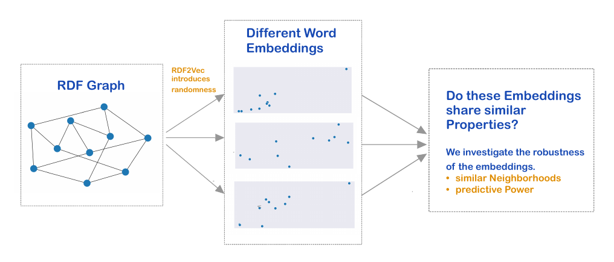

# Investigating the Robustness of RDF2Vec
A seminar work at Ruhr-University Bochum (Seminar on Knowledge Graphs, 2020).

In times of the *semantic web* there is much data available in the
form of knowledge graphs. 
However, as many machine learning algorithms rely on 
numeric data, it is required to transform the data from the space 
of graphs to a (for instance) euclidean space to execute downstream
tasks.
We call a numeric presentation of the graphs entities a *graph embedding*.

There are many different approaches to transform the data cite. 
One popular embedding technique is called *RDF2Vec* cite, which transforms
a RDF graph cite based on a random traversion on the graph. One specific 
form of RDF2Vec randomly walks through the graph. These randomly generated 
sequences are interpreted as sentences, which can be used to create embeddings 
in the fashion of word2vec cite. 
Hence, the RDF2Vec algorithm can be summarized as follows:

Consequentially, as the utilized sequences rely on random walks, RDF2Vec relies on 
randomness as well. With this in mind, my aim of the seminar work is to investigate
the robustness of RDF2Vec.

## 1. Notation
Let $E_1, \dots E_K$ be $K$ different embeddings of a RDF graph into
$\mathbb{R}^D$ for a embedding dimension $D$. That is, each embedding 
is of the form E_{d}
$$
    E_k= \begin{pmatrix}
        - & - & e_1 & - & - \\
        - & - & e_2 & - & - \\
        & & \vdots &  & \\
        - & - & e_N & - & 
\end{pmatrix} \in \mathbb{R}^{N \times D},
$$
where 

## 2. How to investigate the Robustness of an Embedding?
In this work, I investigated 2 ways to investigate the robustness. 

### 2.1. The Neighborhood-Similarity
We compare the resulting **neighborhoods of each node**. This is 
especially relevant for downstream clustering of the graphs entities.
   To illustrate this concept, consider a 2-D word embedding, i.e. 
   the entities of the graphs are mapped to $\mathbb{R}^2$. Assume 
   that we apply RDF2Vec 2 times (hence the word2vec embedding in 
   the RDF2Vec algorithm is based on different sequences of random
   walks) and the second embedding $E_2$ is a 90 degrees rotated version 
   of the first embedding $E_1$. Are the two embeddings different from each 
   other? For simplicity consider entity $e_j$ of the graph, which has vector 
   representations $E_{1,j}$ in the first embedding, and $E_{2,j}$ in the second 
   embedding. In terms of average euclidean distance between 
   the nodes in both embeddings, i.e. $\Vert E_{1,j} - E_{2,j}\Vert_2^2$ the embedding algorithm seems to be very instable.
   On the other hand, many machine learning algorithms are invariant under rotation and translation, such as the family of k-NN algorithms. To be more precise, these algorithms
   take the neighborhoods, i.e. the $k$ nearest (usually in terms of euclidean distance) other vector presentations of the nodes into account. It is clear that rotation does not
   affect the neighborhood of a node, hence, in terms of neighborhood-similarity, the 
   two embeddings would be very similar. 
   
   This leads us to the first measure of robustness, motivated by the question:
      How similar are the neighborhoods of the embedded nodes that result from different iterations of RDF2Vec?
   To quantify the similarity, we employ the *Jaccard similarity* between different sets: 
   Let $N_1, N_2$ be two sets. Then, the Jaccard similarity is defined as 
   $$
      J(N_1, N_2) := \frac{N_1 \cap N_2}{N_1 \cup N_2}.
   $$
   In our appplication, we define $N^{e_i}_1, N^{e_i}_2$ to be the k-neighborhood of node $e_i$ in the embedding $E_1$ and $E_2$, respectively. Averaging over all different nodes, we obtain the similarity between two embeddings:
   $$
      S_{\operatorname{nh}}(E_1, E_2) := \frac{1}{n} \sum_{j=1}^n J(N^{e_j}_1, N^{e_j}_2).
   $$
   Having K different embeddings $E_1, \dots , E_K$, we define the similarity between them as the average over the similarity of each pair of embeddings:
   $$
      S_{\operatorname{nh}}(E_1, \dots , E_K) :=\frac{1}{K(K-1)/2}\sum_{1\leq i < j \leq K} S(E_i, E_j).
   $$
   
   
### 2.2. The Predictive-Similarity
The second approach is based on the idea that similar embeddings should lead to similar predictions. In this case, we have several graph entities that belong to a specific class. For instance, the AIFB dataset (details in Section ...) includes entities that describe a specific professor, which belongs to the class of academic stuff. One prediction task could be, given the graph embedding of an entity, to predict the entity class. Let $E_1, E_2$ be two embeddings, and let $C$ be a classification algorithm that maps a vector presentation of an entity to a class. We denote the classifier trained via $E_1, E_2$ by $C_1, C_2$, respectively. Again, how can we define a similarity measure between $E_1$ and $E_2$? 
We simply measure the average amount of similar predictions, i.e. 
$$
   S_{\operatorname{pred}}(E_1, E_2) := \frac{1}{n} \sum_{j=1}^n *1*_{C_1(E_1^{e_j})=C_2(E_2^{e_j})}. 
$$
Note, in practice we do not average over the whole set of embedded entities but instead we divide the embedding into a test and training set. Evaluation of the similarity is then done by averaging over the test set.
Similar to the neighborhood approach, we measure the similarity of a set of embeddings $E_1,\dots ,E_K$ by doing pair-wise averages:
$$
   S_{\operatorname{pred}}(E_1, \dots, E_K) := \frac{1}{n(n-1)/2} \sum_{1\leq i < j \leq n} S_{\operatorname{pred}}(E_i, E_j).
$$

# 3. The Embedding Dimension
In theory, one could freely choose the dimension $D$ of the embedding in RDF2Vec. However, there is a trade-off that one must consider: 
Increasing the dimensionality of the embedding clearly increases the expressive power of the final embedding. However, when data is limited, it is hard to 

# 4. Implementation
## 4.1. Software
-rdflib 
-RDF2Vec 
## 4.2. Data
Due to computational limitations, I investigated the following 
small sized data sets:
1. **AIFB:** Describes an research institute (*AIFB*) including its
staff, research groups, publications, and so on.
   
2. **MUTAG:** Biological dataset that cotains information about 
molecules that are potentially carcinogenic 
   
3. **BGS:** (*British Geological Survey*) Contains geological
measurements in Great Britain. 
   
## 4.3. Installing
To install the required software simply run :

`pip install -r requirements.txt` 
## 4.4. How the git is organized
The different programms are designed to be run in the following order:
0. `cd code` to switch to the code directory.
1. `python generateEmbeddings.py` to generate the embeddings. 
   The user can choose between various parameters, see 
   `python generateEmbeddings.py -h`. 
2. `python dim_reduction.py` to apply a dimension reduction on the 
embeddings from step 1. The user can choose between various parameters, see 
   `python dim_reduction.py -h`. To run the script for all possible 
   configurations run `python run_dimred.py`. 
3. `python stability_analysis.py` to run the stability analysis 
according to Section 2.1 (*The Neighborhood-Similarity*). The user can choose between various parameters, see 
   `python stability_analysis.py -h`. To run the script for all possible 
   configurations run `python run_stab_ana.py`.
   
4. `python results.py` to summarize the results in a table. In 
addition you can generate corresponding boxplots that depict 
   the characteristic of the empirical distribution of the pairwise 
   Jaccard distances J(N^{e_j}_{i}, N^{e_j}_{k}): `python boxplots.py`

5. The results that correspond to the *Predicitve-Similarity* 
from Section 2.2. can be accessed via the notebook (for instance 
   using jupyter lab): `jupyter lab prediction_class.ipynb`.
# 5. Result
In the following, we see the summarized results in the form 
of two boxplots that measure the empirical robustness of RDF2Vec
in terms of *Neighborhood-Similarity* and *Predictive-Similarity*, 
respectively. The result for the *AIFB* data set are by far the best.
To access the other results, see `scores/mutag/plots/` and 
`scores/bgs/plots/`.

# 6. Conclusion

