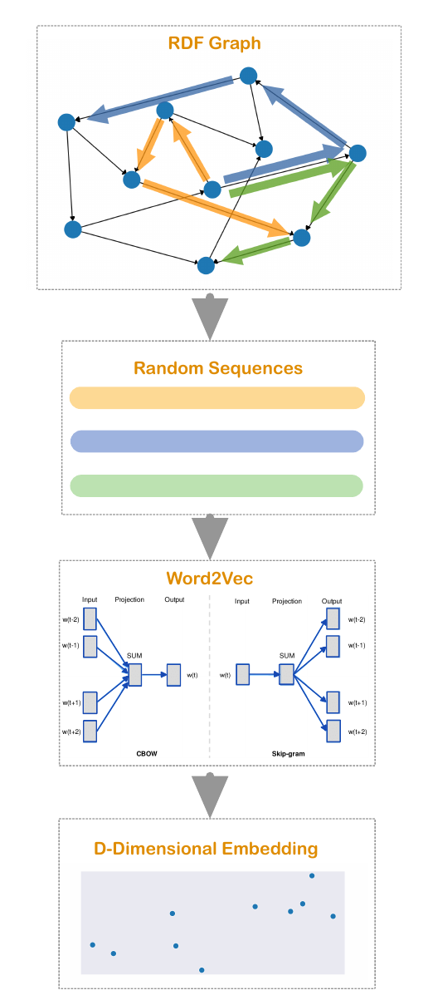
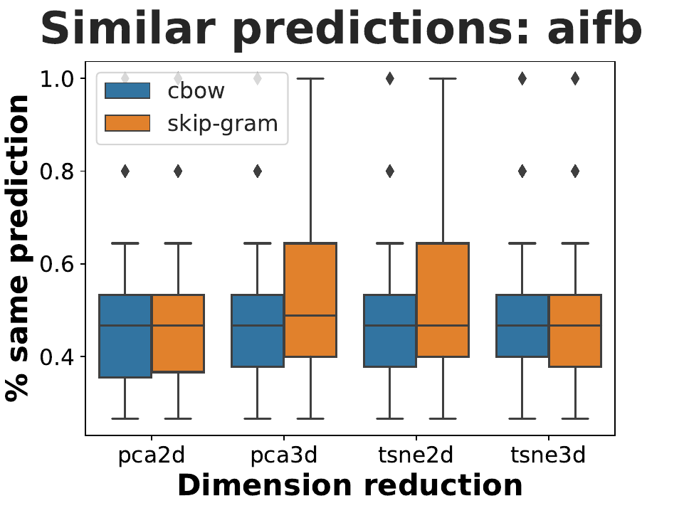

# Investigating the Robustness of RDF2Vec

In times of *semantic web* there is much data available in the
form of knowledge graphs. 
However, as many machine learning algorithms rely on 
numeric data, it is required to transform the data from the space 
of graphs to a (for instance) euclidean space to execute downstream
tasks.
We call a numeric representation of the entities in a graph a *graph embedding*.

There are various different techniques to embed a graph, see for instance [[1]](#1)
for a brief overview. 
One popular embedding technique is called *RDF2Vec* [[2]](#2), which transforms
a RDF graph based on random traversions on the graph. One specific 
form of RDF2Vec collects random walks on the graph. These randomly generated 
sequences are interpreted as sentences, which can be used to create embeddings 
in the fashion of word2vec [[3]](#3) [[4]](#4). 
Hence, the RDF2Vec algorithm can be summarized as follows:

Consequentially, as the utilized sequences rely on random walks, RDF2Vec relies on 
randomness as well. With this in mind, my aim of the seminar work is to investigate
whether this randomness harms the robustness of RDF2Vec. To do so, we 
randomly generate and compare K different embeddings of the same graph.

## 1. Notation
Let E_1,...,E_K be K different embeddings of a RDF graph into R^D (the 
D-dimensional real vector space) for some embedding dimension D. That is, each embedding 
is a matrix E_k in R^(N x D), where N is the number of entities.
Each row of E_k represents the D-dimensional embedding of an entity.

## 2. How to investigate the Robustness of an Embedding?
After generating K different embeddings, I need to find a metric that 
compares the similarity of the embeddings, which will serve as a measure
of robustness of RDF2Vec.
In this work, I introduce 2 ways to investigate the robustness. 

### 2.1. The Neighborhood-Similarity
One way to measure the similarity of different embeddings is to 
compare the resulting **neighborhoods of each entity**. This is 
especially relevant for downstream clustering of the graphs entities.
   
To illustrate this concept, consider a 2-D word embedding, i.e. 
   the entities of the graphs are mapped onto the 2-dimensional space
 R^2. Assume that RDF2Vec generates 2 embeddings E_1 and E_2, where E_2
   is a 90 degrees rotated version of the first embedding E_1.
*How similar are the embeddings?*  

   In terms of euclidean distance, the two embeddings might heavily differ
from each other even though the different entities are, in relation to 
each other, at the same position. Our intuition would probably led us 
to the conclustion that clustering should yield the same result for 
both embeddings. In fact, many machine learning are also invariant under rotation
and translation, such as the popular family of k-NN algorithms. 
These algorithms take the (euclidean) neighborhood of each data sample
into account.  

This leads us to the first measure of robustness, which aims to answer 
the question:
*How similar are the neighborhoods for each embedded
node that result from different iterations of RDF2Vec?*  

That is, we want to investigate whether RDF2Vec preserves the neighborhoods
across different iterations.

The first measure of robustness is then constructed as follows:
1. For 2 neighborhoods of the same node, we calculate the similarity between 
these as the Jaccard distance of the neighborhoods, that is, 
   we take the intersection of both sets into relation to the union 
   of both sets. This gives us a similarity score, which ranges 
   from 0 to 1, of 2 neighborhoods.
   
2. We can then compute a similarity score of 2 embeddings by 
averaging the similarity of the 2 neighborhoods (step 1) over each node.
   
3. To obtain a similarity score of K>2 embeddings, we repeat
step 2. for each pair of embeddings. Finally, the **Neighborhood-Similarity**
   of the embeddings E_1,...E_K is computed as the average over all
   pairwise similarities of E_i and E_j. 
   
   
### 2.2. The Predictive-Similarity
The second approach is based on the idea that similar embeddings 
should lead to similar predictions. In this case, we have several 
graph entities that belong to a specific class. For instance, 
the AIFB dataset (details in Section 4.2.) includes entities that 
describe a specific professor, which belongs to the class of academic 
stuff. One prediction task could be, given the graph embedding of 
an entity, to predict the entity class. 

To be precise, given some embeddings E_1, ..., E_K we want to train 
K classifier. Each of them is trained with the data (of a training 
subset of ) E_1, ..., E_K, respectively. Then, to compute the 
**Predictive-Similarity** of the embeddings, we investigate the similarity 
of the prediction results (on a test set of E_1, ..., E_K). 
The similarity of the predictions is simply measured as the average
amount of equal predictions of the entities. 

For illustration, consider the following simple example. We have 2 
embeddings with 100 entities. We train two classifier on the first 98
representations of each embedding.
To test the Predictive-Similarity, we investigate the resulting predictions
of the last 2 representations. Assume that the first classifier outputs 
the class types "Academic Stuff" and "Publication" for the representations
of entity 99 and 100. The second classifier outputs the class types 
"Academic Stuff" and "Academic Stuff" for the same entities. 
Hence, as only 1 of 2 predicitons is similar, we would assign these two
embeddings a similarity score of 1/2.  
As in Section 2.1. we can then average the pairwise similarities over 
all embeddings to obtain a similarity score of K>2 embeddings. 
I chose a k-NN classfier with k=20.

# 3. The Embedding Dimension
The embedding dimension plays a crucial role for the representative 
power of an embedding. On the one hand, it is clear the an increment
of the embedding dimension also increases the representational power 
of an embedding. However, there is a drawbacks connected to 
a big embedding dimension: Making the embedding space (R^D) small 
forces the algorithm to select more meaningful/structured 
representations. Hence, we usually do not want D to be 
too large. However, letting D be too small might be too restrictive as
it gets 'harder' to fit all entities (in a meaningful manner) into the small space.

But more importantly, we must pay attention on the fact that weird stuff is happening in
higher dimensions. For instance, [[5]](#5) shows that euclidean distances
,which are used for the neighborhood-similarity,
become, roughly said, 'meaningless' in higher dimensions. This is because the distance 
between entities in higher-dimension spaces converge to the same value.
This phenomenon is quite unintuitive and leads to poor results in our
evaluation. 

Hence, I decided to employ the following pipeline:
1. Generate embeddings with D=100.
2. Employ a dimension reduction algorithm (PCA or t-SNE [[6]](#6)), which 
maps the embedding to a 2- or 3-dimensional space.
   
3. Calculate the metrics from Section 2.1 and 2.2. on the 2- or 
3-dimensional reduced embeddings.
# 4. Implementation
## 4.1. Software
Besides some standard libraries (numpy, pandas, sklearn, etc.) we
employed 
- `rdflib` [[7]](#7) to parse the RDF graphs;
- `pyrdf2vec` [[8]](#8) for a python implementation of RDF2Vec.

## 4.2. Data
Due to computational limitations, I investigated the following 
small sized data sets:
1. **AIFB:** Describes an research institute (*AIFB*) including its
staff, research groups, publications, and so on [[9]](#9).
   
2. **MUTAG:** Biological dataset that cotains information about 
molecules that are potentially carcinogenic [[10]](#10).
   
3. **BGS:** (*British Geological Survey*) Contains geological
measurements in Great Britain [[11]](#11). 
   
In the empirical analysis I employed the same hyper parameters as  [[2]](#2).
## 4.3. Installing
To install the required software simply run :

`pip install -r requirements.txt` 
## 4.4. How the git is organized
The different programs are designed to be run in the following order:
0. `cd code` to switch to the code directory.
1. `python generateEmbeddings.py` to generate the embeddings. 
   The user can choose between various parameters, see 
   `python generateEmbeddings.py -h`. 
2. `python dim_reduction.py` to apply a dimension reduction on the 
embeddings, see Section 3. The user can choose between various parameters, see 
   `python dim_reduction.py -h`. To run the script for all possible 
   configurations run `python run_dimred.py`. 
3. `python stability_analysis.py` to run the stability analysis 
according to Section 2.1 (*The Neighborhood-Similarity*). The user can choose between various parameters, see 
   `python stability_analysis.py -h`. To run the script for all possible 
   configurations run `python run_stab_ana.py`.
   
4. The results that correspond to the *Predicitve-Similarity* 
from Section 2.2. can be accessed via the notebook (for instance 
   using jupyter lab): `jupyter lab prediction_class.ipynb`.
5. `python results.py` to summarize the results in a table. In 
addition you can generate corresponding boxplots that depict the 
   empirical distribution of similarities: `python boxplots.py`.

   
# 5. Result
For the stability analysis, we employed K=10 different embeddings.
The following table shows the *Neighborhood-Similarity* of these embeddings.
Note, that we used 2 variants of RDF2Vec, one that employs word2vec via skip-gram
(sg), and the second one employs word2vec via cbow. For details, I refer to [[2]](#2).
 
|Neighborhood-sim. |AIFB (sg) | BGS (sg) | MUTAG (sg) | AIFB (cbow) | BGS (cbow) | MUTAG (cbow) |
|--------|----------|----------|------------|-------------|------------|--------------|
|PCA2d   | 0.14     | 0.06     | 0.04       | 0.09        | 0.06       | 0.03         |
|PCA3d   | 0.23     | 0.10     | 0.06       | 0.14        | 0.07       | 0.05         |
|tSNE2d | 0.40     | 0.26    | 0.19       | 0.35        | 0.16       | 0.11         |
|tSNE3d | 0.41     | 0.27     | 0.19       | 0.36        | 0.17       | 0.11         |

We observe that RDF2Vec is most stable when applied onto AIFB using t-SNE.
Nonetheless, the robustness is still a bit disappointing since, in average, the 
neighborhoods are only 41% similar to each other. For the other 2 data sets, the
robustness is much worse.

The following boxplot depicts the empirical distribution of similarities between 
neighborhoods.

Finally, we plot a boxplot that depicts the *Predictive-Similarity* of each entity
across the embeddings:

Importantly, note that I trimmed down the data such that we end up with a classification 
problem with only 3 classes. This is due to underrepresentation of various classes.
In the case of AIFB, the class labels were "Publication", "Person", and "InProceedings".
Again, we observe that the median performance swings around 0.5, which is quite 
disappointing since we considered only a 3-label-classification problem. 

# 6. Conclusion
RDF2Vec is a popular graph embedding technique, however due to the inclusion 
of random walks, it relies on randomness.
To investigate the robustness of RDF2Vec in spite of the randomness, I 
introduced 2 measures for the similarity of various embeddings, the *Neighborhood-Similarity* and the 
*Predictive-Similarity*. The final results in Section 5. seemingly lead to the 
conclusion that RDF2Vec fails to produce robust embeddings. This is true in 
my investigated setting. However, I must emphasize that there are some 
important things to point out: 
1. I analyzed the robustness of the reduced embeddings (via dimension reduction). 
Hence, the dimension reduction algorithms might be a reason for the bad performance
   in terms of robustness. Especially as t-SNE itself relies on randomness.
   
2. On the other hand, analyzing the similarity in the 100-dimensional embedding 
space also did not lead to good results. But this is probably because 
   euclidean neighborhoods are not a suitable measure for similarity in 
   high-dimensional spaces. 
   
Therefore, interesting follow-up works might be 
a) to investigate the robustness 
when RDF2Vec directly embeds the graph into a low-dimensional space, or
b) to investigate the robustness in the high-dimensional space, R^100 for instance,
but using a better-suited similarity measure for these spaces, see [[12]](#12). 

## References
<a id="1">[1]</a> 
Wang, Q., et al. (2017).
Knowledge graph embeddings: A survey of approaches and applications.
IEEE Transactions on Knowledge and Data Engineering.

<a id="2">[2]</a> 
Ristoski, P., Paulheim, H. (2016).
Rdf2vec: Rdf graph embeddings for data mining.
International Semantic Web Conference.

<a id="3">[3]</a> 
Mikolov, T., et al. (2013).
Distributed representations of words and phrases and their compositionality.
Neural information processing systems.

<a id="4">[4]</a> 
Mikolov, T., et al. (2013).
Efficient estimation of word representations in vector space.
arXiv preprint arXiv:1301.3781.

<a id="5">[5]</a> 
Giraud, C. (2014).
Introduction to high-dimensional statistics, Section 1.
CRC Press.

<a id="6">[6]</a> 
van der Maaten, L. (2008).
Visualizing Data using t-SNE.
Journal of Machine Learning Research.

<a id="7">[7]</a> 
https://github.com/RDFLib/rdflib

<a id="8">[8]</a> 
Vandewiele, G., et al. (2020).
pyRDF2Vec: Python Implementation and Extension of RDF2Vec.

<a id="9">[9]</a> 
Bloehdorn, S., Sure, Y. (2007).
Kernel methods for mining instance data in ontologies.
Proceedings of the 6th International The Semantic Web and 2Nd Asian Conference
on Asian Semantic Web Conference.

<a id="10">[10]</a> 
http://dl-learner.org

<a id="11">[11]</a> 
http://data.bgs.ac.uk/

<a id="12">[12]</a> 
Hinneburg, A., et al. (2000).
What is the nearest neighbor in high dimensional spaces?
International Conference on Very Large Data Bases.